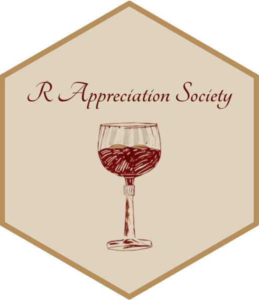
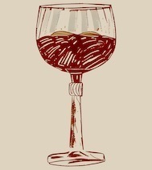

```{r setup, include=FALSE}
knitr::opts_chunk$set(echo = FALSE, message = FALSE, warning = FALSE)
```

## A Hex Sticker for our group



## The main steps

1. Find a nice image
1. Use the `sticker()` function from the `hexSticker` package
1. Tweak the colours and fonts

## 1. Find a nice image



## 2. Use the `hexSticker::sticker()` function 

```{r, echo = TRUE}
library(hexSticker)

img <- here::here("wine-glass.jpeg")

p <- sticker(img, package = "R Appreciation Society")

plot(p)
```

## 3. Tweak the image position and colour

```{r, echo = TRUE}
# Create sticker
p <- sticker(img, 
             package="R Appreciation Society", 
             p_color = '#63100a',
             p_size=10, s_x=1, s_y=.75,
             h_fill = '#ded3bf',
             h_color = '#b68e59',
             filename="rappsoc-logo.png")

plot(p)
```

## 4. Tweak the font

```{r, echo = TRUE}
## Loading Google fonts (http://www.google.com/fonts)
sysfonts::font_add_google("Tangerine", regular.wt = 700)

## Automatically use showtext to render text for future devices
showtext::showtext_auto()

# Create sticker
p <- sticker(img, package="R Appreciation Society", p_color = '#63100a', p_family = "Tangerine",
        p_size=16, s_x=1, s_y=.75,
        h_fill = '#ded3bf',
        h_color = '#b68e59',
        filename="rappsoc-logo.png")

plot(p)
```

## Workflow

1. Code stored on GitHub 
1. Organised as R Project
1. Literate programming to create this powerpoint
